# Business-Analysis-using-Spreadsheet-Basics-1
This is my worksheet from the [Introduction to Business Analysis using Spreadsheet: Basic](https://www.coursera.org/projects/business-analysis-using-spreadsheets) course.
The following is an explanation of each sheet in the worksheet:

<!--------------------------------------- T1-01 ------------------------------------------->
<details>
<summary>T1-01</summary>

### You can add a header

You can add text within a collapsed section. 

You can add an image or a code block, too.

```ruby
   puts "Hello World"
```
</details>

<!--------------------------------------- T1-02 ------------------------------------------->
<details>
<summary>T1-02</summary>

### You can add a header

You can add text within a collapsed section. 

You can add an image or a code block, too.

```ruby
   puts "Hello World"
```
</details>

<!--------------------------------------- T1-03 ------------------------------------------->
<details>
<summary>T1-03</summary>
 
This sheet perform arithmetic operators. The operators would be:
  
1. Addition `+`
2. Substraction `-`
3. Multiplication `*`
4. Division `/`

In this case we have to calculate **Total Price** of Banana and Apple, So we use addition and multiplication operators.

**Column F** is the price of one apple and one banana. 

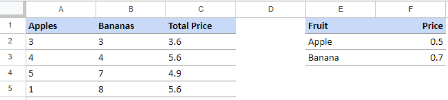
</details>

<!--------------------------------------- T2-01 ------------------------------------------->
<details>
<summary>T2-01</summary>

We can calculate data using operator or function. 

`Column C` perform calculate data using operator and `Column D` using function.

`C2` and `D2` are value of average data

`C3` and `D3` are value of addition data

`C4` and `D4` are value of addition data

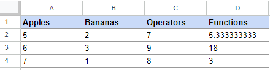

</details>


<!--------------------------------------- T2-02 ------------------------------------------->
<details>
<summary>T2-02</summary>


We have data in range `A1:D11`. Then We do some calculation to answer question below:

1. The total number of all fruits. 			
2. The total number of apples			
3. The total number of kiwis			
4. The total average of all fruits			
5. The total average of bananas			
6. The total average of Pinapple			

The answer will be in range `E13:E18`

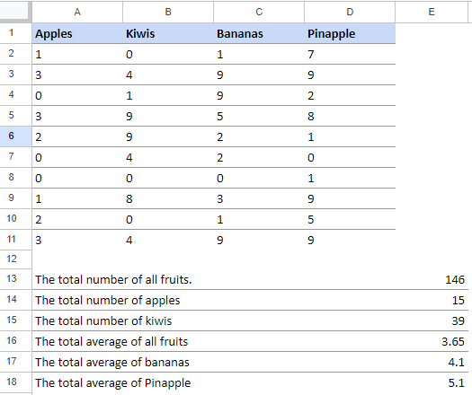
</details>


<!--------------------------------------- T3-01 ------------------------------------------->
<details>
<summary>T3-01</summary>

Next, we going to clean the data. We will remove duplicate data.

The data source in range `A1:A8`. Manually, We found that we have duplicate data in cell `A3` and `A8`.

Remove duplicate manually take time when working with large data sets. So, we going to run function that can remove duplicate data. 

1. Select range `A1:A8`
2. Go to `Data >> Data cleanup >> Remove duplicates`

The result will be in `Column C`.

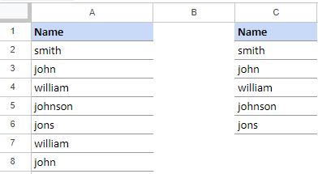
</details>

<!--------------------------------------- T3-02 ------------------------------------------->
<details>
<summary>T3-02</summary>

Next task, split column into two column. We use function in menu `Data >> Split text to column >> Select separator in Space`

Then, `Column Name` become `First Name` and `Last Name`. 

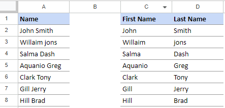

</details>

<!--------------------------------------- T3-03 ------------------------------------------->
<details>
<summary>T3-03</summary>

Here we do sorting data in range `A1:B8`. We sort `First Name` in ascending.

The result in `Column D` and `Column E` we see **Aquanio Greg** is placed in the first list. 

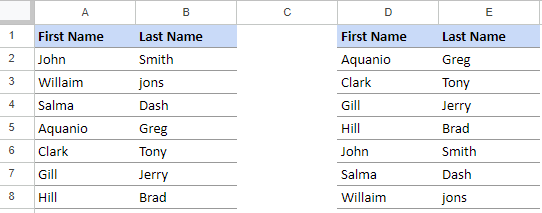
</details>

<!--------------------------------------- T3-04 ------------------------------------------->
<details>
<summary>T3-04</summary>

In spread sheet we can filter data. When the data is filtered, only rows that meet filter criteria will be displayed and other will be hidden.  

We perform filter in range `A:A`.

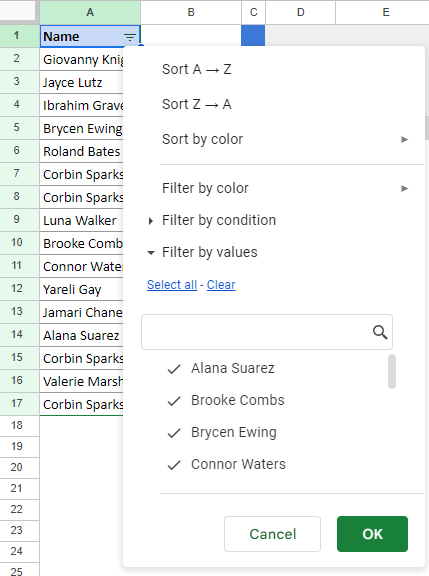
</details>

<!--------------------------------------- T3-05 ------------------------------------------->
<details>
<summary>T3-05</summary>

### You can add a header

You can add text within a collapsed section. 

You can add an image or a code block, too.

```ruby
   puts "Hello World"
```
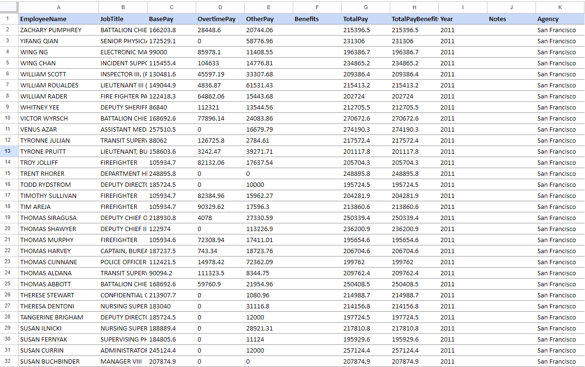
</details>

<!--------------------------------------- T4-01 ------------------------------------------->
<details>
<summary>T4-01</summary>

### You can add a header

You can add text within a collapsed section. 

You can add an image or a code block, too.

```ruby
   puts "Hello World"
```
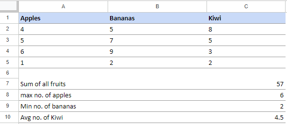
</details>

<!--------------------------------------- T4-02 ------------------------------------------->
<details>
<summary>T4-02</summary>

### You can add a header

You can add text within a collapsed section. 

You can add an image or a code block, too.

```ruby
   puts "Hello World"
```
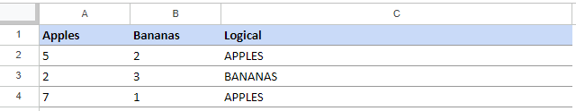
</details>

<!--------------------------------------- T4-03 ------------------------------------------->
<details>
<summary>T4-03</summary>

This task, we analyze data using logical and agregate function. 

`AND Function` the condition is
```
  IF A2>B2 AND A2>C2 = TRUE
    RETURN "Apples"
  ELSE
    RETURN "No apples"
```
`OR Function` the condition is
```
  IF A3>B3 OR A3>C3 = TRUE
    RETURN "Yes"
  ELSE
    RETURN "No"
```
`NOT Function` the condition is
```
  NOT (TRUE)
    RETURN "Yes"
```
We type each function in range `C7:C9` according to the syntax of spreadsheet

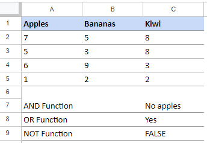
</details>

<!--------------------------------------- T5-01 ------------------------------------------->
<details>
<summary>T5-01</summary>

Next, we try some of logical agregation function in spreadsheet for data source in range `A1:A19`.
As we can see, we use the spreadsheet function in `Column C` and the result in `Column D`.

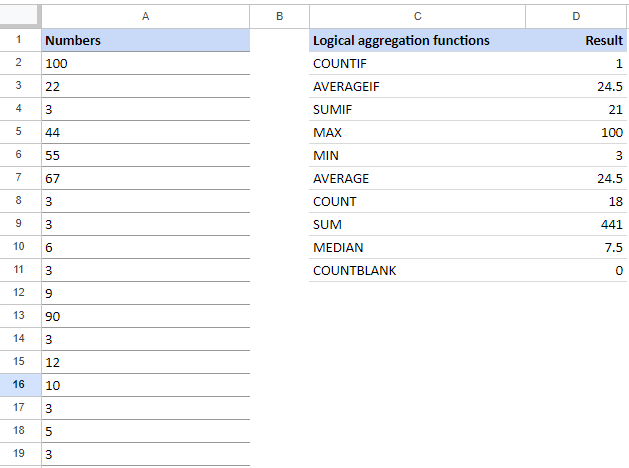
</details>

<!--------------------------------------- T5-02 ------------------------------------------->
<details>
<summary>T5-02</summary>

Here is the bar chart. Bar chart are commonly used to compare several categories of data. 
We try to compare price of Apples, Bananas, Oranges, Kiwi.

The following bar show that Kiwi has highest price than the other fruit. Followed by Banana, Orange and the last is Apple.

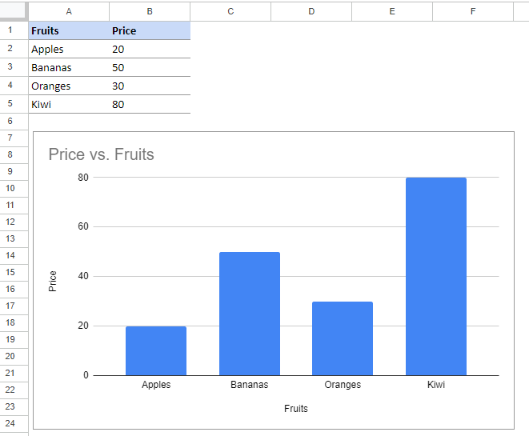
</details>

<!--------------------------------------- T5-03 ------------------------------------------->
<details>
<summary>T5-03</summary>

The last task, we visualize data in range `A1:D11`. We use line chart to perform data. Line chart usually used to show the change data over the time.

For instance, the following line graph shows number of bananas and apple in period 6 june to 16 june.

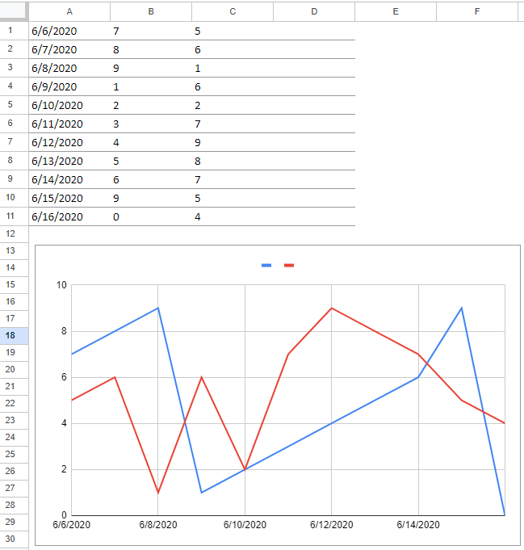
</details>
